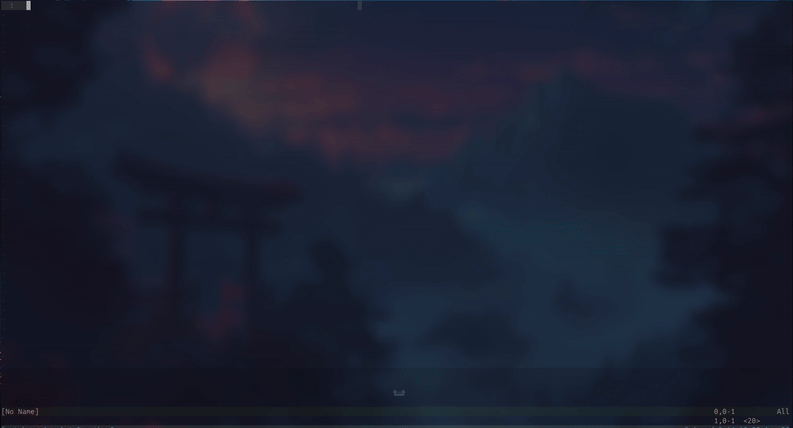

<div align="center">
  
</div>

<div align="center"> 
A minimalist Neovim plugin to keep simple notes per project - right inside your editor
</div>

---

## Preview




## Installation

Using [lazy.nvim](https://github.com/folke/lazy.nvim):

```lua
{
  "ricarim/notekeeper.nvim",
  config = function()
    require("notekeeper").setup()
  end
}
```

## Usage 

After installation:
- Press `<leader>n` to open the NoteKeeper UI or run `:Notekeeper` from the command line


